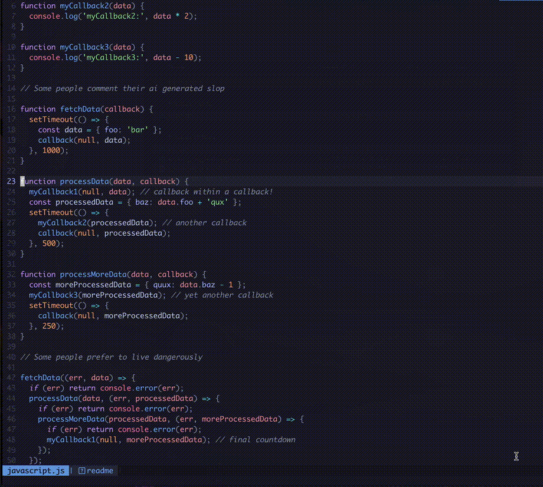

<span style="height: 20px;">
  
</span>
<a href="https://neovim.io/" style="vertical-align: middle;"></a>

# Treewalker.nvim



Treewalker is a plugin that gives you the ability to **move around your code in a syntax tree aware manner**.
It uses [Treesitter](https://github.com/tree-sitter/tree-sitter) under the hood for syntax tree awareness.
It offers four subcommands: Up, Down, Right, and Left. Each command moves through the syntax tree
in an intuitive way.

* **Up/Down** - Moves up or down to the next neighbor node
* **Right** - Finds the next good child node
* **Left** - Finds the next good parent node

---

Moving slowly, showing each command


---

### Installation

##### Lazy:
```lua
{
  "aaronik/treewalker.nvim",
  opts = {
    highlight = true -- default is false
  }
}
```

#### Mapping

This is how I have mine mapped; in `init.lua`:

```lua
vim.api.nvim_set_keymap('n', '<C-j>', ':Treewalker Down<CR>', { noremap = true })
vim.api.nvim_set_keymap('n', '<C-k>', ':Treewalker Up<CR>', { noremap = true })
vim.api.nvim_set_keymap('n', '<C-h>', ':Treewalker Left<CR>', { noremap = true })
vim.api.nvim_set_keymap('n', '<C-l>', ':Treewalker Right<CR>', { noremap = true })
```
