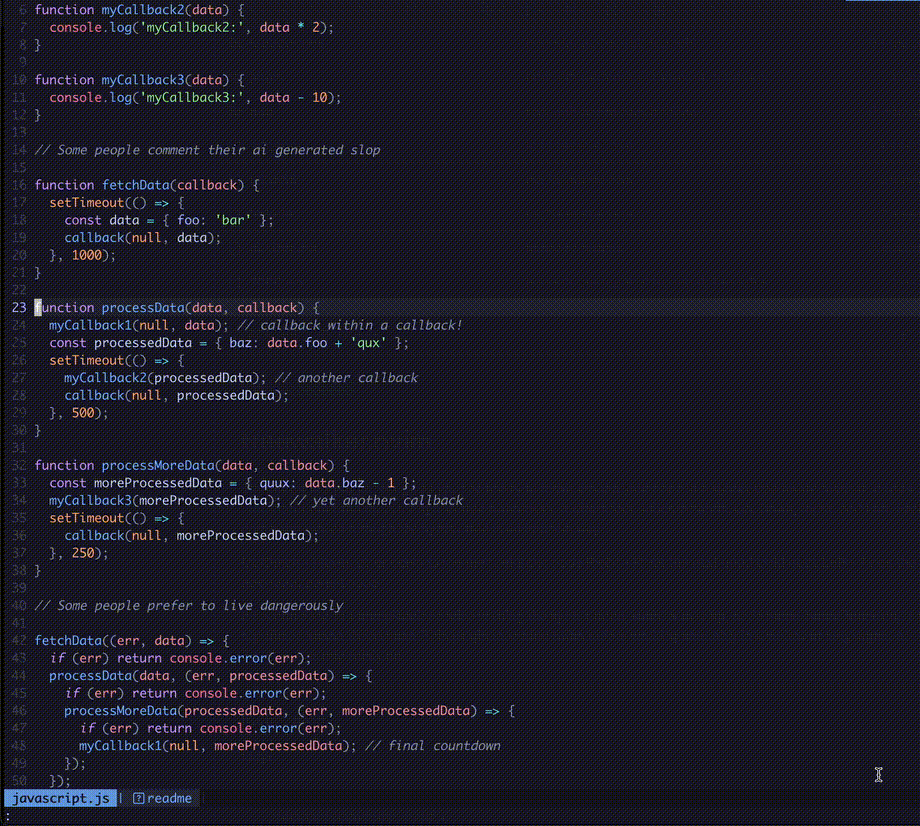
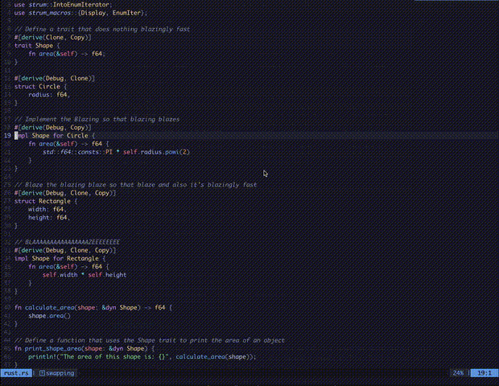

<div align="center">
    <h1>Treewalker.nvim<br><br>🌳🌲🌴🌲🌴🌳</h1>
    <h4 align="center">
        <a href="#Installation">Installation</a>
        ·
        <a href="#Mapping">Mapping</a>
    </h4>
    <a href="https://neovim.io/">
        
    </a>
    
    
    
    
</div>

<br>


<div align="center">
    <h2>Move around your code in a syntax tree aware manner.</h2>
    <p>
        Treewalker uses neovim's native <a href="https://github.com/tree-sitter/tree-sitter">Treesitter</a> under the hood for syntax tree awareness.
        Design goals include stability, ergonomics, and simplicity.
    </p>
</div>

---

## Movement

The movement commands move you through the syntax tree in an intuitive way:

* **`:Treewalker Up`** - Moves up to the previous neighbor node, skipping comments, annotations, and other unintuitive nodes
* **`:Treewalker Down`** - Moves down to the next neighbor node, skipping comments, annotations, and other unintuitive nodes
* **`:Treewalker Left`** - Moves to the first ancestor node that's on a different line from the current node
* **`:Treewalker Right`** - Moves to the next node down that's indented further than the current node

All movement commands add to the [`jumplist`](https://neovim.io/doc/user/motion.html#jumplist), so if you use a movement command
and then feel lost, you always have `Ctrl-o` available to bring you back to where you last were.

---

## Swapping

`Swap{Up,Down}` operate on a linewise basis, and **bring along their comments, decorators, and annotations**.
These are meant for swapping declarations and definitions - things that take up whole lines.

`Swap{Left,Right}` are meant for swapping function arguments, enum members, list elements, etc. Things that are many per line.
In some cases these will operate on the same nodes as Up/Down, but won't take the accoutrements.

* **`:Treewalker SwapUp`** - Swaps the highest node on the line upwards in the document
* **`:Treewalker SwapDown`** - Swaps the biggest node on the line downward in the document
* **`:Treewalker SwapLeft`** - Swap the node under the cursor with its previous neighbor
* **`:Treewalker SwapRight`** - Swap the node under the cursor with its next neighbor

---

## More Examples

<details>
<summary>Typing out the Move commands manually</summary>

</details>

<details>
<summary>Typing out the SwapUp/SwapDown commands manually</summary>

</details>

---

## Installation

#### [Lazy](https://github.com/folke/lazy.nvim)
```lua
{
  'aaronik/treewalker.nvim',

  -- The following options are the defaults.
  -- Treewalker aims for sane defaults, so these are each individually optional,
  -- and setup() does not need to be called, so the whole opts block is optional as well.
  opts = {
    -- Whether to briefly highlight the node after jumping to it
    highlight = true,

    -- How long should above highlight last (in ms)
    highlight_duration = 250,

    -- The color of the above highlight. Must be a valid vim highlight group.
    -- (see :h highlight-group for options)
    highlight_group = 'CursorLine',
  }
}
```

#### [Packer](https://github.com/wbthomason/packer.nvim)
```lua
use {
  'aaronik/treewalker.nvim',

  -- The setup function is optional, defaults are meant to be sane
  -- and setup does not need to be called
  setup = function()
      require('treewalker').setup({
        -- Whether to briefly highlight the node after jumping to it
        highlight = true,

        -- How long should above highlight last (in ms)
        highlight_duration = 250,

        -- The color of the above highlight. Must be a valid vim highlight group.
        -- (see :h highlight-group for options)
        highlight_group = 'CursorLine',
      })
  end
}
```

#### [Vim-plug](https://github.com/junegunn/vim-plug)
```vimscript
Plug 'aaronik/treewalker.nvim'

" This line is optional
:lua require('treewalker').setup({ highlight = true, highlight_duration = 250, highlight_group = 'CursorLine' })
```

---

## Mapping

I've found Ctrl - h / j / k / l to be a really natural flow for this plugin, and adding
Shift to that for swapping just felt so clean. So here are the mappings I use:

In `init.lua`:

```lua
-- movement
vim.keymap.set({ 'n', 'v' }, '<C-k>', '<cmd>Treewalker Up<cr>', { silent = true })
vim.keymap.set({ 'n', 'v' }, '<C-j>', '<cmd>Treewalker Down<cr>', { silent = true })
vim.keymap.set({ 'n', 'v' }, '<C-h>', '<cmd>Treewalker Left<cr>', { silent = true })
vim.keymap.set({ 'n', 'v' }, '<C-l>', '<cmd>Treewalker Right<cr>', { silent = true })

-- swapping
vim.keymap.set('n', '<C-S-k>', '<cmd>Treewalker SwapUp<cr>', { silent = true })
vim.keymap.set('n', '<C-S-j>', '<cmd>Treewalker SwapDown<cr>', { silent = true })
vim.keymap.set('n', '<C-S-h>', '<cmd>Treewalker SwapLeft<cr>', { silent = true })
vim.keymap.set('n', '<C-S-l>', '<cmd>Treewalker SwapRight<cr>', { silent = true })
```

---

## Alternatives

* [syntax-tree-surfer](https://github.com/ziontee113/syntax-tree-surfer)
is the closest thing to Treewalker. I only created Treewalker because I
couldn't get syntax-tree-surfer to work :/. Treewalker has a robust test suite,
makes use of the type system, has CI (automated testing), and has organized
code (so the plugin should be pretty stable). I believe Treewalker usage is a
little bit simpler and more intuitive. Treewalker is missing the visual
selection swap feature that syntax-tree-surfer has, though. syntax-tree-surfer
is also publicly archived.

* [nvim-treehopper](https://github.com/mfussenegger/nvim-treehopper)
is similar in that it uses the AST to navigate, but it takes more of a
[leap](https://github.com/ggandor/leap.nvim) like approach, only annotating
interesting nodes.

* [nvim-treesitter-textobjects](https://github.com/nvim-treesitter/nvim-treesitter-textobjects)
can swap
[a subset of node types](https://github.com/nvim-treesitter/nvim-treesitter-textobjects?tab=readme-ov-file#built-in-textobjects),
but misses some types (ex. rust enums). `Treewalker` is not aware of node type
names, only the structure of the AST, so left/right swaps will work mostly
where you want it to. It can also move to nodes, but treats node types individually,
whereas `Treewalker` is agnostic about types and just goes to the next relevant node.

* [nvim-treesitter.ts_utils](https://github.com/nvim-treesitter/nvim-treesitter/blob/master/lua/nvim-treesitter/ts_utils.lua)
offers a programmatic interface for swapping nodes. It doesn't suffer from node
type awareness, and works mostly the same as `Treewalker` under the hood. Some
of `Treewalker`'s left/right swapping code is inspired by `ts_utils`.
`Treewalker` operates a little differently under the hood, picking the highest
startwise coinciding node over the lowest. But mostly it does the work of
finding the next relevant node and packaging it all up into a nice interface.


